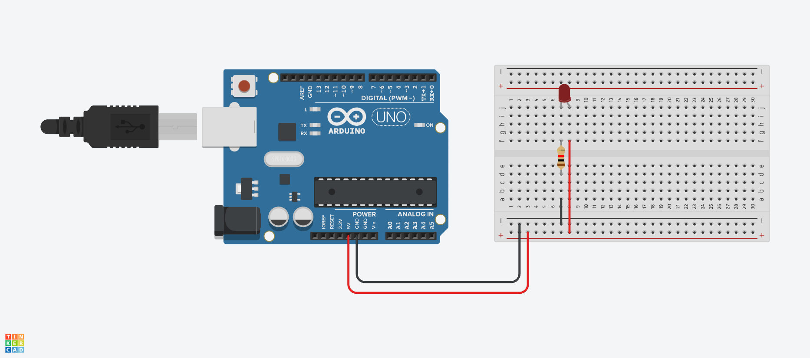
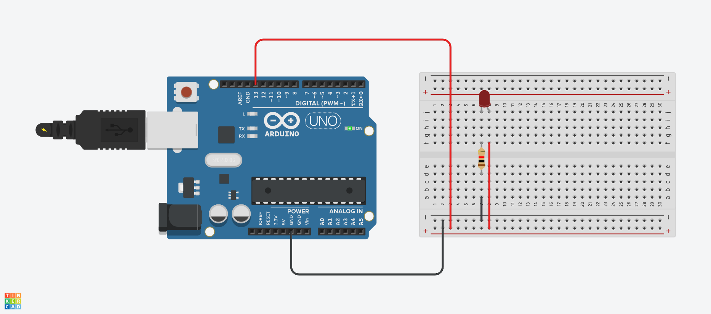
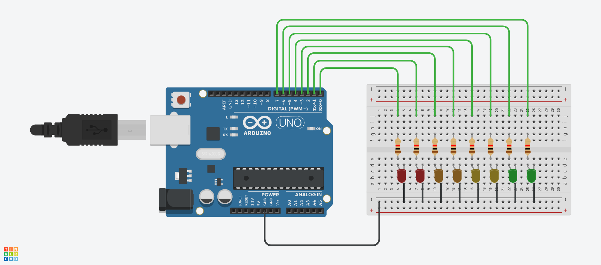

# Erste Stunde

## erstes Erfolgserlebnis

Bild 1: Schaltkreis einer einfachen leuchtenden LED

Bild 2: Schaltkreis mit blinkender LED  
Dazu gehört der Quellcode der Datei [blinking.ino](src/blinking/blinking.ino)

Bild 3: Schaltkreis mit mehreren LED die in einer Laola-Welle durchlaufen.  
Dazu gehört der Quellcode der Datei [laola.ino](src/laola/laola.ino)

## Controller - Microprozessor

Ersteres enthällt zusätzlich zum Prozessor noch Peripheriebausteine wie:  
analog-digital digital-analog Wandler, Timerbaustein

## Pull-Up/ -Down Widerstand

Pull-Up Widerstand zieht Spannung im Leerlauf auf die Eingangsspannung (High). Pull-Down widerum auf Ground(Low).

## Haupt - und Steuerstromkreis

von [wikipedia.org](https://de.wikipedia.org/wiki/Hauptstromkreis#:~:text=Steuerstromkreise%20beinhalten%20die%20notwendige%20Logik,Notausstromkreise%20meist%20zu%20den%20Steuerstromkreisen.)
> Der **Hauptstromkreis**, auch als Laststromkreis bezeichnet, wird mit dem Laststrom der Verbraucher beaufschlagt und stellt einen Teil einer elektrischen Schaltung dar. Er wird aus den Hauptgeräten und den Hauptleitungen gebildet. Dabei werden die Hauptgeräte vom Hauptstrom in einer bestimmten Reihenfolge durchflossen:
>
> 1. Elektrische Sicherung  
> 2. Hauptschalter  
> 3. Hauptschütz  
> 4. Motorschutzschalter  
> 5. Verbraucher  
>
> [...]
>
> Von den Hauptstromkreisen sind die **Steuerstromkreise** zu unterscheiden. Steuerstromkreise beinhalten die notwendige Logik zur Steuerung oder Verriegelung der Hauptstromkreise. Steuerstromkreise sind häufig Teil der Schaltungen rund um eine speicherprogrammierbare Steuerung. Ebenso zählen Notausstromkreise meist zu den Steuerstromkreisen.
