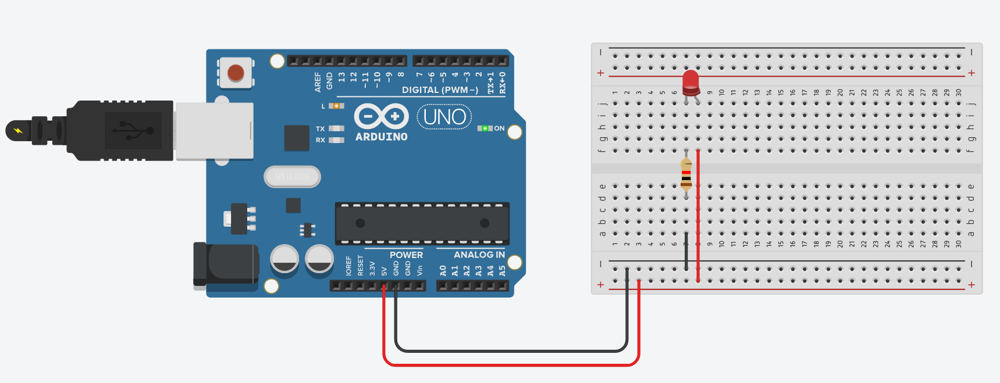
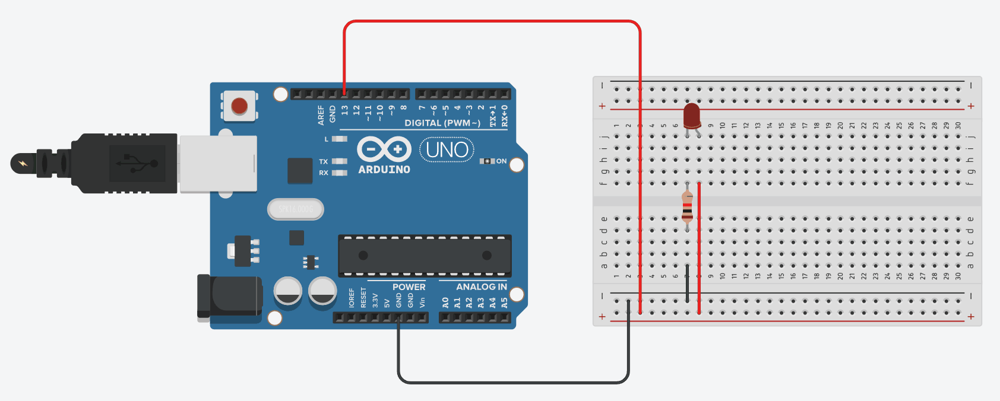

# Erste Stunde

## praktische Beispiele

### Time to shine

  
Schaltkreis einer einfachen leuchtenden LED. Dazu wird der 5V sowie der Ground Ausgang des Arduinos mit der LED über einen Vorwiderstand verbunden.  

### Blinking

  
Schaltkreis mit blinkender LED. Dazu werden die Methoden digitalWrite() zum Setzen des Zustandes und delay() zum Verzögern genutzt.  
Dazu gehört der Quellcode der Datei [blinking.ino](src/blinking/blinking.ino)

### Random

  
Schaltkreis mit einer RGB LED, die zufällig ihre Farbe ändert. Dazu wird die Methode random() genutzt.  
Dazu gehört der Quellcode der Datei [random.ino](src/random/random.ino)  

### eight in a row

![Video of a curcuit containing a arduino and a breadboard. The 8 digital Ports 0 to 7 of the Arduino are each connected to a LED through a resistor. The eight LEDs are in a row on the breadboard. The other side of each of the LEDs is connected to the Ground Port of the Arduino. At first, only the first two LEDs from the left are on. Then the next LED right to them turns on and the left LED turns off. This movement continous until it reaches the right end. From there it jumps back and begins from the left side.](media/laola_LED.gif)  
Schaltkreis mit mehreren LED die in einer Laola-Welle durchlaufen werden.  
Dazu gehört der Quellcode der Datei [laola.ino](src/laola/laola.ino)

## Theorie

### Controller - Microprozessor

Ersteres enthällt zusätzlich zum Prozessor noch Peripheriebausteine wie:  
analog-digital digital-analog Wandler, Timerbaustein

### Pull-Up/ -Down Widerstand

Pull-Up Widerstand zieht Spannung im Leerlauf auf die Eingangsspannung (High). Pull-Down widerum auf Ground(Low).

### Haupt - und Steuerstromkreis

von [wikipedia.org](https://de.wikipedia.org/wiki/Hauptstromkreis#:~:text=Steuerstromkreise%20beinhalten%20die%20notwendige%20Logik,Notausstromkreise%20meist%20zu%20den%20Steuerstromkreisen.)
> Der **Hauptstromkreis**, auch als Laststromkreis bezeichnet, wird mit dem Laststrom der Verbraucher beaufschlagt und stellt einen Teil einer elektrischen Schaltung dar. Er wird aus den Hauptgeräten und den Hauptleitungen gebildet. Dabei werden die Hauptgeräte vom Hauptstrom in einer bestimmten Reihenfolge durchflossen:
>
> 1. Elektrische Sicherung  
> 2. Hauptschalter  
> 3. Hauptschütz  
> 4. Motorschutzschalter  
> 5. Verbraucher  
>
> [...]
>
> Von den Hauptstromkreisen sind die **Steuerstromkreise** zu unterscheiden. Steuerstromkreise beinhalten die notwendige Logik zur Steuerung oder Verriegelung der Hauptstromkreise. Steuerstromkreise sind häufig Teil der Schaltungen rund um eine speicherprogrammierbare Steuerung. Ebenso zählen Notausstromkreise meist zu den Steuerstromkreisen.
