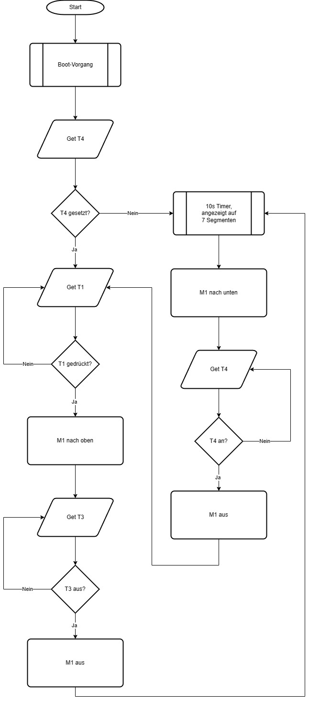

# Dritte Stunde

## Praxis

### Nutzen eines Timers zum präzisen Anschalten einer LED durch einen Interrupt

  
Der Arduino besitzt zwei 8 Bit und ein 16 Bit Timer. Bei einer CPU Frequenz von 16 Mhz lassen sich so mit 16 Bit nur maximal 4,096 ms zählen. Deswegen  wird immer nach einer Millisekunde des Timers ein Interrupt ausgelöst, der einen Zähler um eins erhöht und den Timer zurücksetzt. Innerhalb der loop-Funktion wird geprüft, ob der Zähler den Wert 500 erreicht hat. In diesem Fall wird die LED an-, bzw. ausgeschalten und der Zähler wieder zurückgesetzt.

## Theorie

### Interrupt - Unterbrechung

Wenn ein Interrupt ausgelöst wird, wird die aktuelle Verarbeitung unterbrochen, es wird zu einer anderen Stelle gesprungen, eine ISR (Interrupt Service Routine) ausgeführt und anschließend wieder zum normalen Programmfluss zurückgesprungen. Über einen solchen (zeitbasierten) Interrupt lässt sich beispielsweise ein Scheduler realisieren.

## Rolltor

Aufgabe:  
Zeichnung eines Ablaufdiagramms eines automatisierten Rolltores mit folgenden Bestandteilen:
Mikrocontroller, Motor, H-Brücke, 2 Taster (hoch, runter), 2 Endschalter (wann schranke ganz oben/ unten), 2*7 Segment für 10s counter. (Zusatz: Ampel,  Notaus)  
Lösung:
  
[Quelltext](src/rolltor/rolltor.puml)
