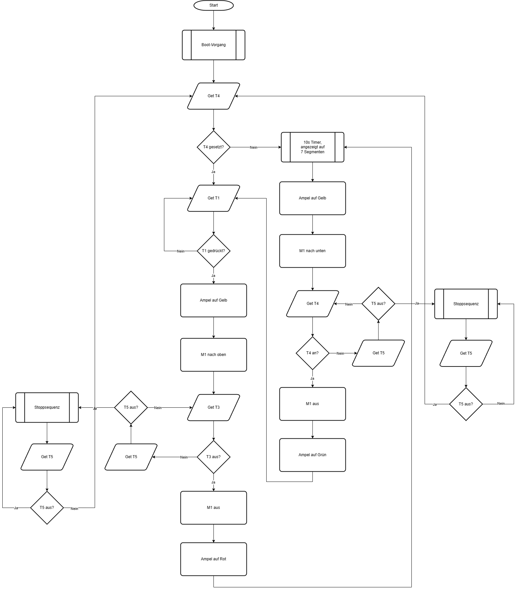
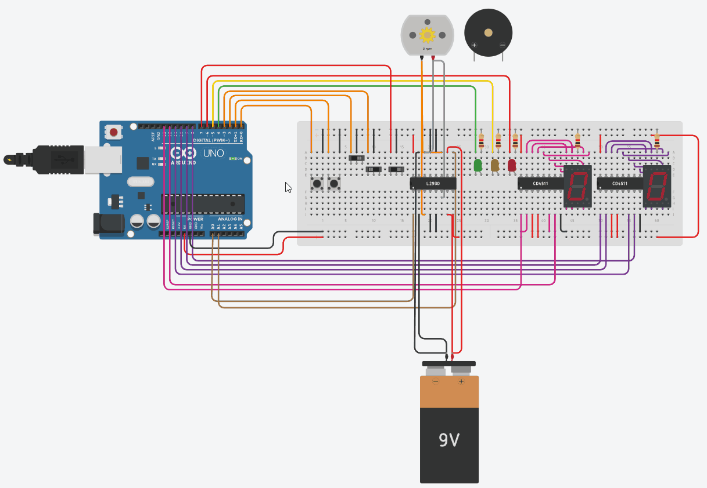
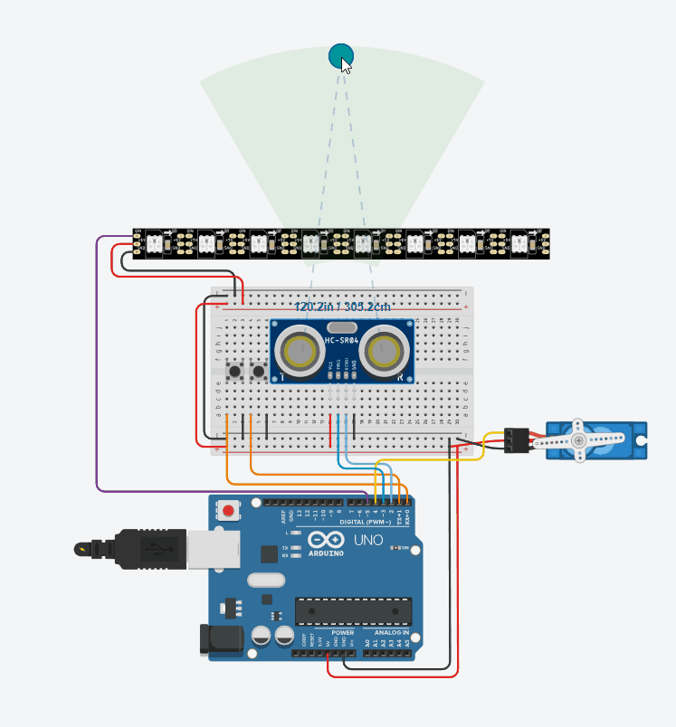

# Dritte, Vierte und Fünfte Stunde

## Praxis

### Nutzen eines Timers zum präzisen Anschalten einer LED durch einen Interrupt

  
Der Arduino besitzt zwei 8 Bit und ein 16 Bit Timer. Bei einer CPU Frequenz von 16 Mhz lassen sich so mit 16 Bit nur maximal 4,096 ms zählen. Deswegen  wird immer nach einer Millisekunde des Timers ein Interrupt ausgelöst, der einen Zähler um eins erhöht und den Timer zurücksetzt. Innerhalb der loop-Funktion wird geprüft, ob der Zähler den Wert 500 erreicht hat. In diesem Fall wird die LED an-, bzw. ausgeschalten und der Zähler wieder zurückgesetzt.  
Siehe [interrupt_to_blink.ino](src/interrupt_to_blink/interrupt_to_blink.ino)

## Theorie

### Interrupt - Unterbrechung

Wenn ein Interrupt ausgelöst wird, wird die aktuelle Verarbeitung unterbrochen, es wird zu einer anderen Stelle gesprungen, eine ISR (Interrupt Service Routine) ausgeführt und anschließend wieder zum normalen Programmfluss zurückgesprungen. Über einen solchen (zeitbasierten) Interrupt lässt sich beispielsweise ein Scheduler realisieren.

### Rechenleistung

Operationen pro Sekunde. Muss für ein Projekt so schnell sein, dass die notwendigen Operationen in akzeptabler Zeit erfolgen können.  

### Entwurf eines Projektes

1. Anforderungsanalyse
2. Auswahl Hardware/ Software
3. Planen des Programmablaufes (Diagramm, CAD)
4. Implementierung

### Unterschied zwischen Assembly und C++ Programmierung

Bei A wird der gesamte Programmcode auf den MC gespielt. Bei C wird nur ein flexibler Teil des Programmcodes aus Hochsprache eingebettet (Bootloader bleibt bestehen). A ist präziser, während C einfacher und schneller geht.  

## Rolltor

### Programmablauf

Aufgabe:  
Zeichnung eines Programmablaufdiagramms (nach DIN 66001) eines automatisierten Rolltores mit folgenden Bestandteilen:
Mikrocontroller, Motor - M1, H-Brücke, 2 Taster (Tor hoch - T1, Tor runter - T2), 2 Endschalter (wann schranke ganz oben - T3/ unten - T4), 2*7 Segment für 10s counter. (Zusatz: Ampel,  Notaus - T5, Ton wenn Motor läuft)  
Lösung:  
  

### Implementierung

  
Hier zu sehen das Programm, jedoch noch ohne LED Ampel, Beeper und Notaus. #TODO  
Siehe [rolltor.ino](src/rolltor/rolltor.ino)

## Türöffner

Anforderungen:
Zwei Taster (T1 - auf, T2 - zu), Einen Ultraschallsensor S1, ein Microcontroller (Arduino), ein Servomotor M, ein LED-Streifen L (Standardmäßig Blau, wenn Tür aufgeht wird L proportional dazu Grün, wenn Tür offen Läuft Roter Punkt zurück (repräsentiert 8s Timer), dann geht Tür wieder zu).  

### Umsetzung

Für die Implementierung wurden die zwei Bibliotheken `Servo.h` (für die Ansteuerung des Servomotors) und `Adafruit_NeoPixel.h` (für die Ansteuerung des LED-Streifens) genutzt.
Siehe [tuer.ino](src/tuer/tuer.ino)
